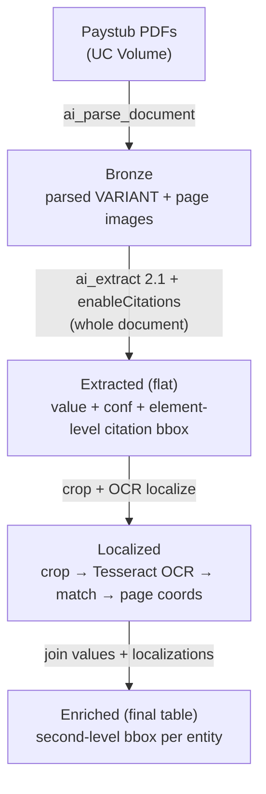

# AI Extract Word-Level Citation

A Databricks pipeline that pinpoints *where inside a cited element* an
`ai_extract` entity sits — the specific **word(s)** of a paragraph or **cell** of
a table — rather than the whole-element citation bbox that `ai_extract` v2.1
returns. It parses each PDF, extracts fields with element-level citations, then
crops the cited element and uses **OCR word boxes + string-matching** to localize
the entity down to a second-level (word-level) box.

The worked example is a **paystub**: a single document type, so there is no page
classification or page split — one `ai_extract` schema runs over the whole parsed
document. The same skeleton generalizes to any single-type document; swap the
schema in the extract stage.

Background and the design rationale are in
[`../second-level-bbox-recommendation.md`](../second-level-bbox-recommendation.md).
The short version: `ai_parse_document` + `ai_extract` v2.1 (`enableCitations`)
give **element-level** citation bboxes (whole table / whole paragraph). To get a
**second-level** box, crop the cited element and use OCR for the *geometry* — a
general VLM is the wrong tool for emitting pixel coordinates.

The same logic ships in two flavors:

- **Notebooks** under `notebooks/` — interactive development with widget-driven
  config (`config.yaml`) and an inline, color-keyed citation renderer for
  eyeballing results.
- **Bundle** under `bundle/` — a Databricks Asset Bundle that runs the same
  stages as a **batch job on serverless**, triggered manually (upload PDFs → run
  job → read the enriched table) and idempotent via `CREATE OR REPLACE` /
  overwrite.

## Architecture



## Scope (single document type)

- **Source:** one document type — paystubs — so there is **no page
  classification and no page split**; a single `ai_extract` schema runs over the
  whole parsed document.
- **Localizer:** **Tesseract OCR only** (`pytesseract`; Tesseract ships on the
  Databricks runtime, so no weights download and CPU-only). VLM *disambiguation*
  (a text answer, never coordinates) is a documented extension point, not built
  here.
- **Goal:** score OCR localization on the sampled entities (numeric table-cell +
  text paragraph cases). The recommendation expects ~80%+ with OCR alone —
  clearing that bar is the gate before scaling out.

## Pipeline stages

| # | Notebook (interactive) | Bundle src (batch) | Output |
|---|---|---|---|
| 01 | `01_parse_extract_citations.py` | `01_bronze_parse.py` | `*_bronze_parsed_docs` — `(path, parsed VARIANT)` + page images |
| 02 | *(part of NB01)* | `02_extract_flat.py` | `*_extracted`, `*_extracted_flat` — value + confidence + element-level citation ids/bbox |
| 03 | `02_localize_and_visualize.py` | `03_localize.py` | `*_ocr_tokens`, `*_localized`, `*_enriched` — second-level word boxes (`*_enriched` is the final output) |

**Notebooks vs. bundle granularity:** NB01 does parse → `ai_extract` → flatten and
ends with an **inline `CitationRenderer`** (color-keyed per field, document
dropdown) so you can eyeball the element-level boxes; NB02 does the crop → OCR →
match localization and renders scored panels. The bundle splits the same work
into three discrete tasks and persists the `*_enriched` table as its final
output instead of rendering inline.

## Output tables

Every table is keyed off `table_prefix` in `catalog.schema`:

- **`*_bronze_parsed_docs`** — one row per source PDF, `parsed` VARIANT from
  `ai_parse_document`; page images written to `_artifacts/<prefix>/` for OCR.
- **`*_extracted`** — the raw `ai_extract` v2.1 VARIANT (citations + confidence).
- **`*_extracted_flat`** — one typed column per field plus `<field>_extract_conf`,
  `<field>_citation_ids`, and the `citations` / `citation_pages` / `parsed_elements`
  arrays the localizer consumes.
- **`*_ocr_tokens`** — Tesseract token boxes per cropped element.
- **`*_localized`** — the best-match second-level box per entity (crop-local →
  page coords, plus match confidence).
- **`*_enriched`** — extracted values joined to their localizations; the
  pipeline's final output.

> **`ai_extract` v2.1 output is VARIANT, not STRUCT.** With citations + confidence
> enabled, each field's value lives at `$.response.<field>.value`, the per-field
> citation ids at `$.response.<field>.citation_ids`, and the citation/page arrays
> at `$.metadata.citations` / `$.metadata.pages`. The flat stage reads these with
> `variant_get(col, '$.response.<field>.value', '<TYPE>')`. Paths are **confirmed
> from a real run**; if your build wraps values differently, inspect with the
> `to_json` cell first.

## Directory layout

```
ai-extract-word-level-citation/
├── notebooks/                          # Interactive dev (config.yaml driven)
│   ├── 01_parse_extract_citations.py   # parse → ai_extract → flatten + inline CitationRenderer
│   └── 02_localize_and_visualize.py    # crop → Tesseract OCR → match → scored panels
├── sample_data/                        # 4 synthetic Oracle-Payslip-style paystubs (fake PII)
│   └── paystub_synth_[1-4].pdf         # generated by scripts/generate_sample_paystubs.py
├── tests/                              # pytest for the bundle's pure helpers (uv run pytest)
│   └── test_localize_lib.py
└── bundle/                             # Batch DAB
    ├── databricks.yml                  # variables, dev/prod targets
    ├── resources/
    │   └── word_level_citation.job.yml # 3-task DAG, serverless env v5, manual trigger
    └── src/
        ├── 01_bronze_parse.py          # batch binaryFile read → ai_parse_document → bronze
        ├── 02_extract_flat.py          # ai_extract 2.1 → flatten citations
        ├── 03_localize.py              # crop + Tesseract OCR → second-level boxes → *_enriched
        └── localize_lib.py             # pure helpers (coord math, OCR matching) — unit-tested
```

## Default workspace targets

| Variable | Default | Used by |
|---|---|---|
| catalog | `fins_genai` | both |
| schema | `unstructured_documents` | both |
| volume | `paystubs` | both |
| volume_subdir | `""` (volume root) | both |
| table_prefix | `paystub_bbox_stream` | bundle |

The bundle keeps its page images and crops under a sibling `_artifacts/<prefix>/`
root on the volume; source PDFs are left untouched.

## Quickstart

### 0. Auth (one-time / when expired)

The source data lives in the **`fevm-azure`** workspace. If the CLI token is
expired:

```bash
databricks auth login --profile fevm-azure
```

Confirm the paystub PDFs and their subfolder under the volume:

```bash
databricks fs ls dbfs:/Volumes/fins_genai/unstructured_documents/paystubs --profile fevm-azure
```

Set the `volume_subdir` widget/variable to that subfolder (leave blank if the
PDFs sit at the volume root).

### 1A. Run interactively in notebooks

Attach `notebooks/01_parse_extract_citations.py` to **DBR 18.2+ / serverless
env v3+** in the fevm-azure workspace and run it top to bottom (it writes
`config.yaml`). Then run `notebooks/02_localize_and_visualize.py` — it installs
`pytesseract` + `rapidfuzz`, localizes the sampled entities, and renders the
scored panels.

### 1B. Deploy the batch bundle

```bash
cd bundle

# dev target
databricks bundle validate -t dev --profile fevm-azure
databricks bundle deploy   -t dev --profile fevm-azure

# run the job (upload PDFs first, then trigger)
databricks bundle run ai_extract_word_level_citation -t dev --profile fevm-azure

# start clean (drop pipeline tables + artifacts, keep source PDFs)
databricks bundle run ai_extract_word_level_citation -t dev --profile fevm-azure --params reset_data=true

# prod target
databricks bundle deploy -t prod --profile fevm-azure
```

## Batch design: idempotent, manual trigger

The bundle is a **batch** pipeline, not streaming — the intended workflow is
*upload PDFs → run job → read the `*_enriched` table*:

- **01–03 each rebuild their outputs** (full `binaryFile` read + `CREATE OR
  REPLACE` / overwrite), so every run reprocesses the whole volume and is
  idempotent. No checkpoints, no state store.
- **`reset_data=true`** (a per-run job parameter) drops every pipeline table and
  clears the `_artifacts/<prefix>/` subfolders before running, for a clean start.
- The **`*_enriched` table is the final output** — extracted values joined to
  their second-level boxes, ready to query, join, or visualize.

## Requirements

| Component | Requirement |
|---|---|
| `ai_parse_document` | DBR 17.1+ / serverless env v3+ |
| `ai_extract` 2.1 (citations + confidence) | DBR 18.2+ / serverless env v3+ |
| Tesseract OCR | pre-installed on DBR; `pip install pytesseract rapidfuzz`. CPU-only — no GPU needed. |
| Bundle compute | Serverless Jobs, env v5 |

## Results

| Run date | Entities sampled | Localized (≥ threshold) | Hit-rate | Notes |
|---|---|---|---|---|
| _TBD_ | _10_ | _–_ | _–_ | first POC run |

**Decision gate:**

- **Hit-rate ≥ ~80%** → scale out on the batch bundle and persist the second-level
  bbox per entity.
- **Below bar** → add the VLM disambiguation fallback (text answer: "which of
  these OCR tokens is the gross pay?") and re-score.

## Reused machinery

- Crop logic — `Image.open(uri).crop([x1,y1,x2,y2])` from
  [`../document-embedding-chart-analysis/notebooks/03-crop-images-elements.py`](../document-embedding-chart-analysis/notebooks/03-crop-images-elements.py).
- Parse call + paystub `ai_extract` schema mirror the sibling
  [`../document-page-classify-extraction`](../document-page-classify-extraction)
  pipeline.

## Related assets

- `../document-page-classify-extraction` — multi-document classify + extract into
  per-loan gold tables (the streaming sibling this asset borrows conventions from).
- `../document-embedding-chart-analysis` — chart/figure cropping + VLM insights;
  source of the crop logic.
