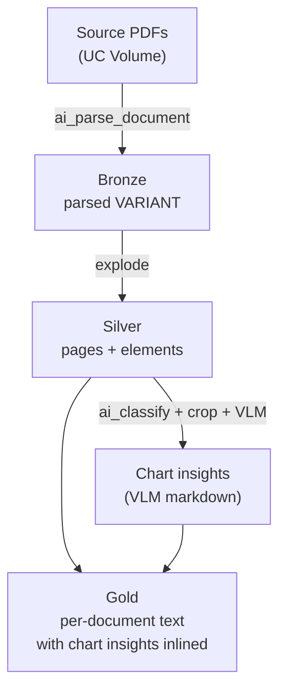

# Document Embedding & Chart Analysis

A 5-stage Databricks pipeline that parses PDFs with `ai_parse_document`, identifies
chart figures with `ai_classify`, runs a vision LLM over each cropped chart, and
splices the resulting chart insights back into a per-document gold table — ready
for embedding, RAG, or downstream extraction.

The same logic ships in two flavors:

- **Notebooks** under `notebooks/` — interactive batch development with widgets
  and inline visualizations.
- **Bundle** under `bundle/` — a Databricks Asset Bundle that runs the same stages
  as an incremental streaming pipeline on serverless, triggered every 15 minutes
  via `Trigger.AvailableNow`.

## Architecture



## Directory layout

```
document-embedding-chart-analysis/
├── notebooks/                         # Interactive batch dev
│   ├── 01-pdf_parsing_ai_parse_document.py
│   ├── 02-visualize-bbox-ai-parse-document-outputs.py
│   ├── 03-crop-images-elements.py
│   ├── 04-prompt-engineering-on-cropped-images.py
│   ├── 05-document-text-with-chart-insights.py
│   └── config.yaml                    # Written by NB01, read by NB02-NB05
├── sample_data/                       # Example PDFs (meta-earning-presentation.pdf)
└── bundle/                            # Streaming DAB
    ├── databricks.yml                 # Bundle config, variables, dev/prod targets
    ├── resources/
    │   └── chart_extraction.job.yml   # One job, 5 sequential tasks, 15-min schedule
    └── src/
        ├── 01_bronze_parse.py         # Auto Loader -> ai_parse_document -> bronze
        ├── 02_silver_explode.py       # 2 streams: pages, elements
        ├── 03_silver_classify_crop.py # ai_classify + crop UDF + MERGE mapping
        ├── 04_chart_insights.py       # Auto Loader on cropped JPGs + VLM UDF + MERGE
        └── 05_gold_merge.py           # foreachBatch -> splice -> MERGE gold
```

The helper script `scripts/upload_pdfs.sh` (at the repo root) uploads local PDFs
into the source UC Volume via the Databricks CLI.

## Default workspace targets

| Variable | Default | Used by |
|---|---|---|
| catalog | `fins_genai` | both |
| schema | `unstructured_documents` | both |
| volume | `pdf_examples` | both |
| volume_subdir | `complex_documents` | both |
| table_prefix (notebooks) | `adv_analysis` | notebooks |
| table_prefix (bundle) | `adv_analysis_stream` | bundle (isolated) |
| llm_model | `databricks-claude-sonnet-4-5` | NB04 / bundle stage 04 |

The bundle deliberately uses a different `table_prefix` so streaming runs never
overwrite notebook outputs in the same workspace.

## Quickstart

### 1. Upload sample PDFs to the volume

```bash
./scripts/upload_pdfs.sh \
  --profile <your_profile> \
  --catalog fins_genai \
  --schema unstructured_documents \
  --volume pdf_examples \
  --folder complex_documents
```

Defaults to uploading everything under `document-embedding-chart-analysis/sample_data/`.

### 2A. Run interactively in notebooks

Open `notebooks/01-pdf_parsing_ai_parse_document.py` in the Databricks workspace,
attach to a cluster on **DBR 17.3+** (required for `ai_parse_document`), then
execute NB01 → NB02 → NB03 → NB04 → NB05 in order. NB01 writes `config.yaml`
which the others read.

### 2B. Deploy the streaming bundle

From inside `bundle/`:

```bash
# dev target (schedule paused; run manually)
databricks bundle validate --profile <your_profile> -t dev
databricks bundle deploy   --profile <your_profile> -t dev
databricks bundle run chart_extraction_streaming --profile <your_profile> -t dev

# prod target (schedule UNPAUSED — every 15 min)
databricks bundle deploy --profile <your_profile> -t prod
```

The job is a 5-task DAG running on serverless env v5; each task uses
`trigger(availableNow=True)` so it processes new data and then exits, fitting
naturally with the scheduled cron.

## Requirements

| Component | Requirement |
|---|---|
| `ai_parse_document` | DBR 17.3+ / serverless env v3+ (we use v5) |
| `ai_classify` | DBR 15.1+ |
| VLM call | A multimodal serving endpoint (default `databricks-claude-sonnet-4-5`) |
| `ai_forecast` / `ai_query` | Not used |
| Bundle compute | Serverless Jobs (no `new_cluster` declared) |

## Output tables (bundle, with default prefix)

| Table | Grain | Purpose |
|---|---|---|
| `adv_analysis_stream_raw_files` | doc | Bronze: source path + `ai_parse_document` VARIANT |
| `adv_analysis_stream_parsed_pages` | page | Silver: `(path, page_id, image_uri)` |
| `adv_analysis_stream_parsed_elements` | element | Silver: `(path, element_id, type, bbox, page_id, content, description)` |
| `adv_analysis_stream_cropped_mapping` | chart element | Silver: maps original `(path, element_id)` to cropped JPG |
| `adv_analysis_stream_chart_insights` | cropped JPG | Silver: VLM markdown analysis per chart |
| `adv_analysis_stream_gold_document_text` | doc | Gold: enriched `full_text` with `[CHART(n): ...]` inlined + structured `chart_insights` ARRAY |

Gold has CDF enabled so a downstream Vector Search Delta Sync index can be
attached to it.
