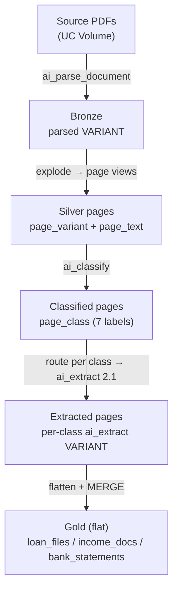

# Document Page Classify & Extract

A Databricks pipeline that parses multi-document PDF packets, classifies each
**page** by document type, and routes each page to a type-specific `ai_extract`
schema — then flattens the results into per-loan gold tables ready for
analytics, joins, or RAG.

The worked example is a **residential mortgage loan file**: a single PDF that
bundles a loan application, pay stubs, W-2s, bank statements, a tax return, an
appraisal, and a closing disclosure. The same skeleton generalizes to any
heterogeneous document packet — swap the labels in NB03 and the schemas in NB04.

The same logic ships in two flavors:

- **Notebooks** under `notebooks/` — interactive batch development with
  widget-driven config (`config.yaml`).
- **Bundle** under `bundle/` — a Databricks Asset Bundle that runs the same
  stages as an incremental streaming pipeline on serverless, triggered every
  15 minutes via `Trigger.AvailableNow`.

## Architecture



## Page classes (NB03)

Single-label classification into one of seven buckets:

| Label | Documents |
|---|---|
| `loan_application` | URLA / Fannie Form 1003 / Freddie Form 65 |
| `income_verification` | pay stubs, W-2s, 1099s, Verification of Employment |
| `bank_statement` | depository / asset account statements |
| `tax_return` | IRS Form 1040 and schedules |
| `property_appraisal` | Uniform Residential Appraisal Report (Form 1004) |
| `closing_disclosure` | TRID Loan Estimate / Closing Disclosure |
| `noise` | fax covers, blanks, separators, signature-only pages |

`noise` pages are dropped before extraction. `credit_report` and
`title_insurance` are documented extension points (add a label in NB03 + a
schema in NB04).

## Pipeline stages

| # | Notebook (batch) | Bundle src (streaming) | Output |
|---|---|---|---|
| 01 | `01_parse_documents.py` | `01_bronze_parse.py` | `*_bronze_parsed_docs` — `(path, parsed VARIANT)` |
| 02 | `02_page_split.py` | `02_silver_pages.py` | `*_silver_pages` — one row per page with `page_variant` + `page_text` |
| 03 | `03_classify_pages.py` | `03_classify_pages.py` | `*_silver_pages_classified` — adds `page_class` |
| 04 | `04_extract_fields.py` | `04_extract_fields.py` | `*_silver_pages_extracted` — one VARIANT column per class |
| 05 | `05_gold_merge.py` | `05_gold_merge.py` | `*_gold_loan_files`, `*_gold_income_docs`, `*_gold_bank_statements` |

**Why two page views (NB02):** `page_variant` is a page-scoped VARIANT mirroring
the `ai_parse_document` schema (all element types, for `ai_extract`);
`page_text` is the chrome-stripped, figure/table-inlined text (for
`ai_classify`).

## Gold layer (NB05)

Flat tables, every extracted field its own typed column:

- **`*_gold_loan_files`** — one row per loan. Singleton-document fields
  (application, tax return, appraisal, closing disclosure) flattened and
  prefixed by class, coalesced across the loan's pages, plus
  `income_doc_count` / `bank_doc_count`.
- **`*_gold_income_docs`** — one row per income document (pay stub, W-2, …).
- **`*_gold_bank_statements`** — one row per statement.

Repeating documents are preserved in full in their own tables (join back on
`path`); the loan table keeps a count. All three have **Change Data Feed**
enabled for downstream Vector Search sync.

> **`ai_extract` v2.1 output is VARIANT, not STRUCT.** With citations +
> confidence enabled, each field's value lives at `$.response.<field>.value`
> (nested objects wrap at the leaf). NB05 reads it with
> `variant_get(col, '$.response.<field>.value', '<TYPE>')`. If your build wraps
> values differently, inspect with the `to_json` cell in NB05 first.

## Directory layout

```
document-page-classify-extraction/
├── notebooks/                       # Interactive batch dev (config.yaml driven)
│   ├── 01_parse_documents.py        # NB01 declares widgets + writes config.yaml
│   ├── 02_page_split.py
│   ├── 03_classify_pages.py
│   ├── 04_extract_fields.py
│   └── 05_gold_merge.py
├── sample_data/                     # 4 synthetic mortgage loan-file PDFs (12 pages each)
├── tests/                           # pytest for the bundle's pure SQL builders (uv run pytest)
│   └── test_sql_builders.py
└── bundle/                          # Streaming DAB
    ├── databricks.yml               # variables, dev/prod targets
    ├── resources/
    │   └── loan_doc_extraction.job.yml   # 5-task DAG, serverless env v5, 15-min schedule
    └── src/
        ├── 01_bronze_parse.py       # Auto Loader → ai_parse_document → bronze (append)
        ├── 02_silver_pages.py       # within-row page split (append, stateless)
        ├── 03_classify_pages.py     # ai_classify → page_class (append)
        ├── 04_extract_fields.py     # per-class ai_extract routing (append)
        ├── 05_gold_merge.py         # foreachBatch + MERGE → 3 flat gold tables
        └── sql_builders.py          # pure SQL-string builders (value_expr/gold_name/build_merge/ai_extract_expr) — unit-tested
```

The repo-root `scripts/` holds two helpers:

- `scripts/generate_sample_loan_files.py` — generates the synthetic loan-file
  PDFs into `sample_data/`.
- `scripts/upload_pdfs.sh` — uploads a folder of PDFs to a UC Volume.

## Default workspace targets

| Variable | Default | Used by |
|---|---|---|
| catalog | `fins_genai` | both |
| schema | `unstructured_documents` | both |
| volume | `pdf_examples` | both |
| volume_subdir | `mortgage_loan_files` | both |
| table_prefix (notebooks) | `loan_docs` | notebooks |
| table_prefix (bundle) | `loan_docs_stream` | bundle (isolated) |

The bundle uses a different `table_prefix` so streaming runs never overwrite
notebook outputs in the same workspace, and keeps its checkpoints/parse-images
under a sibling `_streaming/<prefix>/` root on the volume.

## Quickstart

### 1. Generate sample PDFs

```bash
# from the repo root
uv run --with reportlab python scripts/generate_sample_loan_files.py
```

Writes 4 twelve-page loan-file packets to `sample_data/`.

### 2. Upload to the volume

```bash
scripts/upload_pdfs.sh \
  --profile fevm-azure \
  --catalog fins_genai --schema unstructured_documents \
  --volume pdf_examples --folder mortgage_loan_files \
  --source document-page-classify-extraction/sample_data
```

### 3A. Run interactively in notebooks

Open `notebooks/01_parse_documents.py`, attach to a cluster / serverless on
**DBR 18.2+** (env v3+) for `ai_extract` 2.1, then execute NB01 → NB05 in order.
NB01 writes `config.yaml`, which the others read.

### 3B. Deploy the streaming bundle

```bash
cd bundle

# dev target (schedule paused; run manually)
databricks bundle validate -t dev --profile fevm-azure
databricks bundle deploy   -t dev --profile fevm-azure
databricks bundle run loan_doc_extraction_streaming -t dev --profile fevm-azure

# prod target (schedule UNPAUSED — every 15 min)
databricks bundle deploy -t prod --profile fevm-azure
```

## Streaming design: effectively stateless

The document is the atomic unit — one PDF parses to one bronze row carrying all
its pages and elements — so no logical entity ever spans micro-batches:

- **01, 03, 04 and the companion-table writes are pure per-row maps** → plain
  append streams with `Trigger.AvailableNow`. No state store.
- **02 rebuilds `page_text`/`page_variant` with within-row array functions**
  (not `explode` + `GROUP BY`), keeping it a stateless append. (The batch NB02
  uses a `GROUP BY` because it is a batch query.)
- **Only 05 aggregates**, inside `foreachBatch`: each micro-batch is an ordinary
  batch DataFrame, the per-loan `GROUP BY` runs in batch scope (no watermark /
  state store), and `MERGE` (on `path`, and `(path, page_id)` for companions)
  makes re-processing idempotent.

Re-runs are incremental and idempotent: Auto Loader checkpoints skip
already-parsed PDFs; the gold MERGEs upsert by key.

## Requirements

| Component | Requirement |
|---|---|
| `ai_parse_document` | DBR 17.1+ / serverless env v3+ |
| `ai_classify` | DBR 15.1+ |
| `ai_extract` 2.1 (citations + confidence) | DBR 18.2+ / serverless env v3+ |
| Bundle compute | Serverless Jobs, env v5 |

## Validated run (fevm-azure, dev)

| Stage | Output |
|---|---|
| bronze_parse | 4 rows (4 PDFs) |
| silver_pages | 48 pages (4 × 12) |
| classify_pages | 48 classified |
| extract_fields | 40 (8 `noise` pages dropped) |
| gold | `gold_loan_files`=4, `gold_income_docs`=8, `gold_bank_statements`=4 |

## Related assets

- `../credit-report-extraction` — single-document-type classify + extract
  (Experian Intelliscore business credit reports).
- `../document-embedding-chart-analysis` — chart/figure cropping + VLM insights
  with a parallel streaming bundle (the pattern this asset mirrors).
