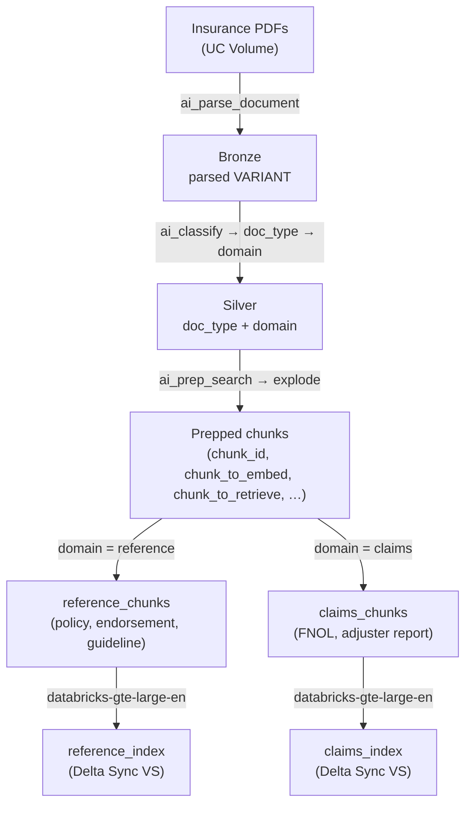

# Insurance Knowledge Base — Parse → Classify → Prep → Index

A Databricks pipeline that ingests insurance PDFs from a Unity Catalog Volume
and turns them into retrieval-ready **Databricks Vector Search** indexes using
only built-in AI Functions. The end-to-end flow is
`ai_parse_document → ai_classify → ai_prep_search → CREATE VECTOR SEARCH INDEX`:
documents are parsed into a structured VARIANT, classified by document type,
semantically chunked, routed by domain into two gold Delta tables, and indexed
— one **reference** index for policy and underwriting documents, one **claims**
index for FNOL forms and adjuster reports. The worked example is a knowledge
base for an insurance **adjuster / underwriter AI assistant**.

The logic ships in two flavors:

- **Notebooks** under `notebooks/` — interactive, one notebook per stage, for
  exploratory use and step-by-step inspection.
- **Bundle** under `bundle/` — a Databricks Asset Bundle that runs the same
  five stages as a batch job on **serverless env v5**, triggered manually
  (upload PDFs → run job → query the indexes).

## Architecture



Data-flow (text):

```
/Volumes/fins_genai/unstructured_documents/pdf_examples/insurance_docs/*.pdf
   │  ai_parse_document
   ▼
bronze_parsed (parsed VARIANT)
   │  ai_classify → doc_type → domain
   ▼
silver_classified
   │  ai_prep_search → explode chunks (+doc_type, +domain)
   ▼
prepped chunks
   │  route by domain
   ├────────────► reference_chunks ──► reference_index
   └────────────► claims_chunks    ──► claims_index
```

## Document types

Five document types split into two retrieval domains:

| `doc_type` | Domain | Persona |
|---|---|---|
| `policy_document` | `reference` | Underwriter |
| `endorsement` | `reference` | Underwriter |
| `underwriting_guideline` | `reference` | Underwriter |
| `fnol_claim_form` | `claims` | Adjuster |
| `adjuster_report` | `claims` | Adjuster |

The `doc_type → domain` routing map lives in
`bundle/src/insurance_kb_sql_builders.py` — a pure-Python helper — so it is
unit-testable without a Databricks connection.

## Pipeline stages

| # | Notebook (interactive) | Bundle src (batch) | Output table |
|---|---|---|---|
| 1 | `01_parse_documents.py` | `01_bronze_parse.py` | `*_bronze_parsed` — `(source_path, parsed VARIANT, parse_error)` |
| 2 | `02_classify_documents.py` | `02_silver_classify.py` | `*_silver_classified` — adds `doc_type`, `domain`, `classification_raw` |
| 3 | `03_prep_search_chunks.py` | `03_prep_search.py` | `*_prepped_chunks` — exploded chunk rows with `chunk_id`, `chunk_position`, `chunk_to_retrieve`, `chunk_to_embed` |
| 4 | `04_route_gold_tables.py` | `04_gold_route.py` | `*_reference_chunks`, `*_claims_chunks` — CDF-enabled gold tables per domain |
| 5 | `05_create_vector_indexes.py` | `05_create_indexes.py` | `*_reference_index`, `*_claims_index` — Delta Sync Vector Search indexes |

**Notebooks vs. bundle:** The bundle `src/` is the canonical, tested
implementation. Notebooks illustrate the same stages interactively and are
useful for exploratory inspection, but the bundle is the authoritative
production artifact.

## Output tables and indexes

All names are keyed off `table_prefix` in `catalog.schema`:

- **`*_bronze_parsed`** — one row per source PDF; `parsed` VARIANT from
  `ai_parse_document`.
- **`*_silver_classified`** — adds `doc_type` (one of the five labels) and
  `domain` (`reference` or `claims`); rows that fail to parse or classify are
  excluded downstream.
- **`*_prepped_chunks`** — exploded chunk rows from `ai_prep_search`, with
  `doc_type` and `source_path` carried through.
- **`*_reference_chunks`** / **`*_claims_chunks`** — gold tables (CDF enabled)
  that feed the Vector Search indexes; schema: `chunk_id` (PK),
  `chunk_position`, `chunk_to_retrieve`, `chunk_to_embed`, `doc_type`,
  `source_path`, `prepped_at`.
- **`*_reference_index`** / **`*_claims_index`** — Delta Sync Vector Search
  indexes, embeddings managed by Databricks (`databricks-gte-large-en`);
  embedding source `chunk_to_embed`, PK `chunk_id`.

The pipeline terminates at index creation — there is no retrieval or query
layer here (see the Related assets section for follow-up possibilities).

## Directory layout

```
insurance-kb-vector-search/
├── notebooks/                              # Interactive/illustrative flavor
│   ├── 01_parse_documents.py               # Stage 1: ai_parse_document → bronze
│   ├── 02_classify_documents.py            # Stage 2: ai_classify → doc_type + domain
│   ├── 03_prep_search_chunks.py            # Stage 3: ai_prep_search → explode chunks
│   ├── 04_route_gold_tables.py             # Stage 4: route by domain → two gold tables
│   └── 05_create_vector_indexes.py         # Stage 5: create Delta Sync VS indexes
├── sample_data/                            # 15 synthetic insurance PDFs (fictional)
│   ├── ground_truth_doc_types.csv          # filename → doc_type (optional accuracy check)
│   └── *.pdf                               # 3 docs × 5 types
├── tests/                                  # pytest for pure helpers (uv run pytest)
│   └── test_insurance_kb_sql_builders.py
└── bundle/                                 # Batch DAB
    ├── databricks.yml                      # variables, dev/prod targets
    ├── resources/
    │   └── insurance_kb.job.yml            # 5-task DAG, serverless env v5, manual trigger
    └── src/
        ├── 01_bronze_parse.py              # batch binaryFile read → ai_parse_document → bronze
        ├── 02_silver_classify.py           # ai_classify → doc_type + domain
        ├── 03_prep_search.py               # ai_prep_search → explode → prepped_chunks
        ├── 04_gold_route.py                # route by domain → two CDF-enabled gold tables
        ├── 05_create_indexes.py            # ensure VS endpoint; create/sync two indexes
        └── insurance_kb_sql_builders.py    # pure helpers: labels, routing map, DDL builders
```

## Default workspace targets

| Variable | Default | Used by |
|---|---|---|
| `catalog` | `fins_genai` | both |
| `schema` | `unstructured_documents` | both |
| `volume` | `pdf_examples` | both |
| `volume_subdir` | `insurance_docs` | both |
| `table_prefix` | `insurance_kb` | bundle |
| `vs_endpoint` | `insurance_kb_vs` | bundle |
| `embedding_model` | `databricks-gte-large-en` | bundle |

Source PDFs live at:
`/Volumes/fins_genai/unstructured_documents/pdf_examples/insurance_docs/`

## Prerequisites

- Databricks workspace with **Unity Catalog**, **Serverless Jobs**, and
  **Vector Search** enabled.
- `ai_prep_search` requires **serverless environment v3+ / DBR 18.2+**; env 5
  is recommended. `ai_parse_document` requires DBR 17.3+ / env v3+.
- Region that supports `ai_parse_document` / `ai_prep_search` batch AI
  inference (check the Databricks regional availability docs if you see a
  "function not available" error).
- Databricks CLI **v0.205+** for `bundle` and `fs` commands.
- CLI profile **`fevm-classic-stable`** configured in `~/.databrickscfg`.
- `uv` + `pytest` for unit tests (`uv run pytest`; no Databricks required).

## Quickstart

### 0. Auth (one-time / when expired)

```bash
databricks auth login --profile fevm-classic-stable
```

### 1. Generate the sample PDFs

From the **repo root**:

```bash
uv run --with reportlab python scripts/generate_sample_insurance_docs.py
```

This writes 15 synthetic insurance PDFs (3 per type × 5 types) and
`sample_data/ground_truth_doc_types.csv` into
`insurance-kb-vector-search/sample_data/`.

### 2. Upload PDFs to the UC Volume

```bash
scripts/upload_pdfs.sh \
  -p fevm-classic-stable \
  -c fins_genai \
  -s unstructured_documents \
  -v pdf_examples \
  -f insurance_docs \
  -i insurance-kb-vector-search/sample_data
```

### 3. Deploy the bundle

```bash
cd insurance-kb-vector-search/bundle
databricks bundle deploy -t dev --profile fevm-classic-stable
```

### 4. Run the job

```bash
databricks bundle run insurance_kb_vector_search -t dev --profile fevm-classic-stable
```

The job runs five tasks in sequence (bronze → silver → prep → gold → index).
After it completes, the two Vector Search indexes are ready to query.

## Testing

Unit tests cover the pure-Python helpers in `insurance_kb_sql_builders.py`
(routing map, label-set integrity, DDL builders). No Databricks connection
required:

```bash
uv run pytest insurance-kb-vector-search/tests/ -v
```

Or run the full repo suite from the root:

```bash
uv run pytest
```

## Batch design: manual trigger

The bundle is a batch pipeline — the intended workflow is
*upload PDFs → run job → query the indexes*:

- Stages 1–4 rebuild their outputs with `CREATE OR REPLACE` / overwrite, so
  every run reprocesses the whole Volume subdir. Note that a full re-run
  recreates the gold tables via `CREATE OR REPLACE`; only the create_indexes
  stage (Stage 5) syncs existing indexes rather than recreating them.
- Stage 5 is create-if-not-exists for the Vector Search endpoint and
  create-or-sync for both indexes (safe across reruns).
- Change Data Feed is enabled on both gold tables so the Delta Sync indexes
  can pick up incremental updates on subsequent runs.

### First run: verify output

After `bundle run` completes, confirm the pipeline produced results:

```sql
-- Check classification worked
SELECT doc_type, domain, COUNT(*) FROM fins_genai.unstructured_documents.insurance_kb_silver_classified
GROUP BY doc_type, domain;
```

If `doc_type` is null or empty, verify that `ai_classify`'s return shape matches
`classification_raw:response[0]::string` in your workspace. Also confirm the
parsed-VARIANT text path (`parsed:pages[*].elements[*].content`) returns
non-empty text for your documents — some `ai_parse_document` versions nest
content under `document` rather than `pages` at the top level.

```sql
-- Check both gold chunk tables are non-empty
SELECT COUNT(*) FROM fins_genai.unstructured_documents.insurance_kb_reference_chunks;
SELECT COUNT(*) FROM fins_genai.unstructured_documents.insurance_kb_claims_chunks;
```

## Related assets

- `../document-page-classify-extraction` — multi-document classify + extract
  pipeline (streaming DAB). The classification pattern here follows similar
  conventions.
- `../evaluation-harness` — recipe notebooks for evaluating
  `ai_parse_document` / `ai_classify` confidence distributions and scoring
  extractions against ground truth. Can be used to evaluate classification
  accuracy with the `ground_truth_doc_types.csv` shipped here.
